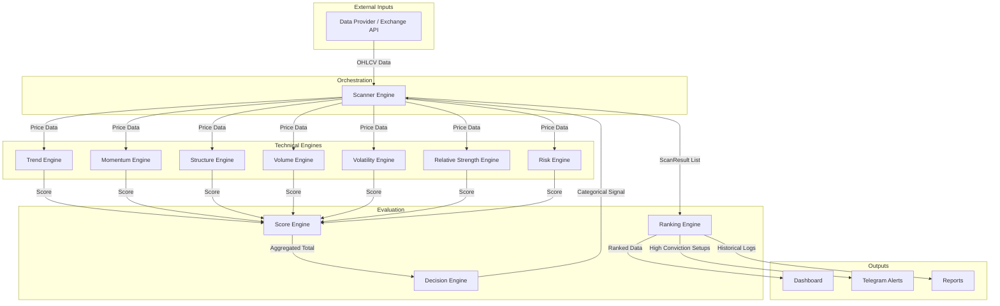

# RAHUUL AI TRADING SUITE

## Vision
To build a world-class, institutional-grade artificial intelligence trading suite focused on the Indian financial markets. The suite aims to empower traders with autonomous scanning, precise technical scoring, dynamic ranking, and real-time execution capabilities.

## Objectives
- Deliver a highly modular, SOLID-compliant, extensible architecture.
- Automate market scanning and real-time technical evaluation across multiple dimensions (Trend, Momentum, Structure, Volume, Volatility, Relative Strength, Risk).
- Generate clear, categorical, and actionable trading signals (STRONG_BUY, BUY, WATCH, WEAK, AVOID).
- Provide seamless integration pathways for broker execution (Dhan), chart-based alerts (Pine Script), and AI-driven coaching.

## Supported Markets
- NIFTY
- BANKNIFTY
- FINNIFTY
- MIDCPNIFTY
- NSE F&O Stocks

---

## System Architecture

### Modules

1. **Market Engine**
   Responsible for interfacing with external data providers (e.g., Yahoo Finance, Dhan) to fetch historical and real-time OHLCV data, market status, and live quotes.

2. **Sector Engine**
   Categorizes the market universe into defined sectors (BANK, IT, AUTO, etc.). Calculates sector-level strength, momentum, and aggregates stock performances to identify top-performing groups.

3. **Trend Engine**
   Analyzes moving averages (EMA20, EMA50, VWAP), price action positioning, and higher timeframe alignment to determine the directional bias of the asset.

4. **Momentum Engine**
   Evaluates the speed and strength of price movements utilizing indicators like RSI, ADX, and MACD to ensure entries align with market momentum.

5. **Structure Engine**
   Maps out market structure by identifying Higher Highs, Higher Lows, Break of Structure (BOS), and Change of Character (CHoCH) patterns.

6. **Volume Engine**
   Examines relative volume (RVOL) and volume profile accumulation/distribution to validate the authenticity of price action and breakouts.

7. **Relative Strength Engine**
   Compares the asset's performance against a benchmark (e.g., NIFTY 50) to identify outperforming and underperforming anomalies.

8. **Risk Engine**
   Calculates precise risk-to-reward ratios, stop-loss placements (ATR/Swing-based), and evaluates overall setup validity to protect capital.

9. **Score Engine**
   The central aggregator. Collects the individual scores from all technical engines (Trend, Momentum, Structure, etc.) and calculates a final weighted `total_score` (0-100).

10. **Scanner Engine**
    The orchestrator of the pipeline. Loops through the defined market universe or sector lists, retrieves data, feeds it to the technical engines, and generates `ScanResult` entities.

11. **Ranking Engine**
    Takes the array of `ScanResult` entities from the Scanner Engine and sorts them mathematically to surface the highest conviction setups.

12. **Decision Engine**
    Translates the numerical outputs from the Score Engine into actionable, human-readable categorical signals (`STRONG_BUY`, `BUY`, `WATCH`, etc.) based on defined threshold rules.

13. **Dashboard**
    The visual presentation layer. Displays real-time ranked lists, sector performance heatmaps, and detailed signal breakdowns for user consumption.

14. **Telegram**
    The notification dispatcher. Responsible for formatting and broadcasting high-conviction trade alerts, target hits, and trailing stop triggers to subscribed Telegram channels.

15. **Reports**
    Generates end-of-day, weekly, and monthly analytical summaries detailing system performance, top sectors, and hit rates for continuous improvement.

---

## Data Flow Diagram

---

## Workflows

### Scanner Workflow
1. The **Scanner Engine** receives a request to scan the market or a specific sector.
2. It requests the predefined stock universe from the **Sector Engine**.
3. It iterates through the stock list, calling the **Market Engine** to download real-time and historical OHLCV data for each ticker.
4. The data is passed to the **Score Engine**.
5. The resulting scores and signals are bundled into `ScanResult` objects.

### Score Workflow
1. The **Score Engine** receives data for a specific asset.
2. It delegates specific mathematical evaluations to the 7 technical engines (Trend, Momentum, Structure, Volume, Volatility, Relative Strength, Risk).
3. Each engine returns an independent score based on the predefined `ScoringWeights` (e.g., Trend=25, Momentum=20).
4. The **Score Engine** aggregates these into a final `total_score` (out of 100) and returns a `ScoreBreakdown`.

### Ranking Workflow
1. After the **Scanner Engine** completes the loop, it passes the unsorted array of `ScanResult` objects to the **Ranking Engine**.
2. The **Ranking Engine** filters out invalid or error-state results.
3. It sorts the array dynamically (typically descending by `total_score` or filtering specifically for `STRONG_BUY` signals).
4. The ranked list is returned to the execution and presentation layers.

### Dashboard Workflow
1. The **Dashboard** polls or subscribes to the **Ranking Engine** output.
2. It structures the top-ranked stocks into a visual grid, highlighting actionable tickers in green and weak tickers in red.
3. It extracts sector metadata from the `ScanResult` objects to display an aggregated sector heatmap.
4. Users interact with the Dashboard to inspect the detailed `ScoreBreakdown` for individual tickers.

---

## Future Integrations

### Future Dhan Integration
The `Market Engine` currently defines abstract interfaces (`MarketDataProvider`). In the future, a concrete `DhanDataProvider` and `DhanExecutionBroker` will be built. This will allow the suite to transition from purely fetching free API data to executing live, algorithmic trades directly on the Dhan platform, utilizing real-time webhooks, order placement, and automated trailing stops.

### Future Pine Integration
While Python serves as the heavy-lifting computational backend, the suite will seamlessly integrate with TradingView Pine Script. The Python backend will act as a centralized webhook listener. Pine Script indicators (like `RAHUUL_PRO.pine`) will emit alerts on chart events, which the Python server will consume, validate against its internal Ranking Engine, and execute or forward to Telegram.

### Future AI Coach
An advanced LLM-powered module designed to interact with the trader. The AI Coach will ingest the `Reports` generated by the system, analyze the user's trading logs, and evaluate market context. It will provide natural language insights, dynamically suggest risk adjustments, warn against trading in poor market conditions, and summarize daily sector performance to enforce disciplined trading psychology.
