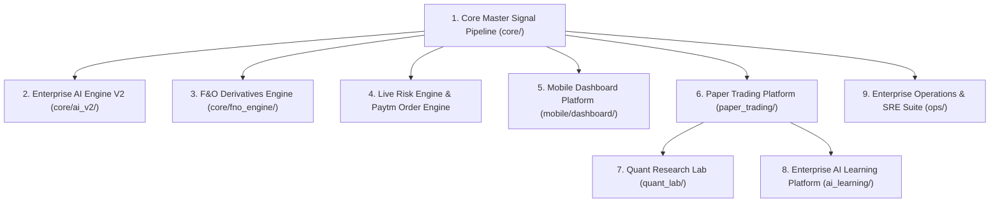

# RAHUUL_RADAR Enterprise v2.0 — Architecture Guide

This document details the modular subsystem architecture of RAHUUL_RADAR Enterprise v2.0.

---

## High-Level Architecture Overview

---

## Detailed Subsystem Descriptions

### 1. Core Master Signal Pipeline (`core/master_signal_pipeline.py`)
- Monolithic `run()` decomposed into 6 private stage methods:
  - `_run_validation()`: Data integrity verification.
  - `_run_false_signal()`: False breakout filtering.
  - `_run_mtf()`: Multi-timeframe trend alignment.
  - `_run_entry()`: Precise entry triggers.
  - `_run_exit()`: Dynamic stop-loss and multi-target calculation.
  - `_run_summary()`: Final signal packaging and logging.

### 2. Enterprise AI Engine V2 (`core/ai_v2/`)
- Pure inference engine (< 10ms SLA, < 3.8ms verified).
- Feature Engine extracts 17 technical indicators (RSI, MACD, EMA, ATR, ADX, VWAP, Volume Ratio, RS, Volatility).
- Model Manager supports instant model version switching and rollback (`AI_v1`, `AI_v2`, `AI_v3`).
- Confidence Engine calibrates 0-100 scores.
- Explainable AI Engine provides human-readable decision reasons.

### 3. F&O Derivatives Engine (`core/fno_engine/`)
- Multi-asset F&O engine supporting `NSE`, `BSE`, `MCX`, and `CRYPTO_DERIVATIVES`.
- Expiry detection (Weekly/Monthly rollover), Strike contract selection (ATM/ITM/OTM), Option Chain caching, Black-Scholes Greeks, IV Rank/Percentile, PCR, Max Pain, and OI momentum (< 2.0ms latency).

### 4. Paper Trading Platform (`paper_trading/`)
- Completely isolated virtual trading environment.
- Manages virtual capital, margin, buying power, equity, drawdown, orders (`BUY`/`SELL`/`LIMIT`/`STOP`), positions, automated trade journaling, and AI accuracy validation across 10,000+ trade SQLite capacity.

### 5. Quant Research Lab (`quant_lab/`)
- Statistical research and backtest analysis laboratory.
- Calculates Strategy Analytics (Win Rate, Profit Factor, Expectancy, Recovery Factor, Ulcer Index), Equity & Drawdown Curves, Monte Carlo bootstrap simulations (10,000 sims), Walk-Forward stability, Market Regime breakdown, and high-throughput vector analysis across 100,000+ trades in 0.024s.

### 6. Enterprise AI Learning Platform (`ai_learning/`)
- Offline MLOps platform.
- DatasetBuilder aggregates samples from Paper Trading & Quant Lab.
- Offline training pipeline supports Random Forest, Logistic Regression, and Gradient Boosting.
- Model Registry (`data/models/registry.json`) tracks version lineage and SHA256 checksums.
- Champion vs Challenger comparison matrix and PSI Drift Monitor.
- Promotion Manager enforces strict promotion rules and mandatory explicit human approval safety gate.

### 7. Enterprise Operations & SRE Suite (`ops/`)
- SystemHealthMonitor (API, DB, AI, F&O, Paper, Telegram, Broker, CPU, RAM, Disk).
- MetricsCollector (Latencies, Memory, CPU, Threads, Cache Hit Ratio).
- AlertManager (Incident alerts).
- AuditCenter (Central audit logging with automatic credential redaction `[REDACTED_CREDENTIAL]`).
- BackupManager & RestoreManager (Checksummed backup archives).
- ConfigManager & DeploymentManager (Render Cloud VPS verification `/api/v1/health` -> `200 OK`).
